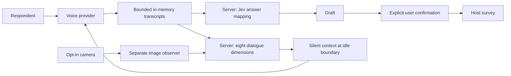

# Integration for the separate feature version

This experimental branch preserves the MIT survey core. Use the feature client and feature handler together; neither accepts a client-supplied model. A model bundle must match the exact server-owned survey, dimensions, rubric order, pinned Jev version and target labels. Scripted demo weights are rejected by the live feature handler. See [feature training](FEATURES.md). The legacy direct-classification API remains available only for compatibility.

# Integration

## Browser and server responsibilities

The browser owns drafts, confirmed answers, current-question transcript memory, media permission and the UI. The server owns the survey definition, model allowlist, long-term keys, user authorization and budget policy. Scoring, persistence, survey distribution and account management belong to the host.



The answer mapper never receives camera/profile inputs. The context classifier receives no answer options or confirmed values. It cannot confirm or navigate. A host can inject a different Mapper, Analyst or VoiceConnection without changing the controller.

## Live browser adapter

```ts
import { createSessionStarter, createCameraObserver, speakingProfile } from "voice-survey-jev-features";
import { mountVoiceSurvey } from "voice-survey-jev-features/browser";
import { createHttpFeatureAnalysis } from "voice-survey-jev-features/features";
import { GeminiVoice, OpenAIVoice } from "voice-survey-jev-features/providers";

const startSession = createSessionStarter("/api/voice-survey");
const widget = mountVoiceSurvey(container, {
  survey,
  candidateLabel: "重み付きモデルの候補（未確定）", scoreLabel: "候補スコア",
  ...createHttpFeatureAnalysis("/api/voice-survey"),
  profile: speakingProfile,
  models: [
    { key: "gemini", label: "Gemini Live", create: () => new GeminiVoice({
      modelKey: "gemini", startSession,
      workletUrl: "/voice/capture-worklet.js"
    }) },
    { key: "openai", label: "OpenAI Realtime", create: () => new OpenAIVoice({
      modelKey: "openai", startSession
    }) }
  ],
  cameraObserver: createCameraObserver("/api/voice-survey"), // Optional.
  onComplete: confirmed => saveThroughYourOwnSurvey(confirmed)
});
```

Serve `dist/capture-worklet.js` and `dist/pcm.js` together in the same directory. When bundling, set `workletUrl` explicitly; the worklet runs as its own module. Bundle the browser entry using your application's bundler. Plain ESM consumers also need to resolve the Google SDK dependency. HTTPS or localhost is required for media access.

The widget asks for separate voice and camera consent. Model switching and question navigation close the old connection and start a new one. This deliberately prevents delayed, untagged audio events from being reassigned to a new question. Confirmed answers remain in the controller. These reconnects can add latency and session charges; the host owns the budget decision.

Call `widget.destroy()` when the host removes the component. Visibility loss and pagehide stop media, pending requests and transcript memory. Manual answers remain usable after any provider error. Provider-specific errors are replaced with generic UI codes.

## Server endpoint

`createFeatureSurveyHandler` accepts standard Fetch API Request/Response objects. Adapt it to your server or worker:

```ts
import { createFeatureSurveyHandler } from "voice-survey-jev-features/server/features";

const handle = createFeatureSurveyHandler({
  bundle: yourLocallyLoadedFeatureBundle, // Weights fitted on actual Jev features.
  survey, // Server-owned; do not trust a client-supplied question/prompt.
  allowedOrigins: [process.env.SURVEY_ORIGIN!],
  authorize: request => yourExistingAuthenticationAndSurveyAuthorization(request),
  consumeBudget: request => yourDistributedSessionBudget(request),
  typesafeApiKey: process.env.TYPESAFE_API_KEY,
  geminiApiKey: process.env.GEMINI_API_KEY,
  openaiApiKey: process.env.OPENAI_API_KEY,
  openaiTranscriptionModel: process.env.OPENAI_TRANSCRIPTION_MODEL,
  visionModel: process.env.GEMINI_VISION_MODEL,
  profile: speakingProfile,
  models: {
    gemini: { provider: "gemini", model: process.env.GEMINI_LIVE_MODEL!, label: "Gemini Live" },
    openai: { provider: "openai", model: process.env.OPENAI_REALTIME_MODEL!, label: "OpenAI Realtime" }
  }
});
```

Only enable models configured and accessible in your own account. For the original Realtime quality/mini comparison, configure the two host model keys with `gpt-realtime-2.1` and `gpt-realtime-2.1-mini` when available to your account; this does not change the model running the development chat. The implementation uses the Realtime contract, not the separate GPT-Live contract.

The default routes are `/api/voice-survey/answer`, `/context`, `/session`, `/camera`. They require POST, JSON, an allowed Origin and successful authorization. Request bodies are bounded to 64KB, or 512KB for camera capture. Responses are no-store; upstream error text, credentials and logs are not returned. Aborts and a 15-second timeout bound client work. Already accepted provider work may still be billed after cancellation.

The local Node example uses a process-level rate window and loopback-only binding. It is an example for one developer, not shared-service authentication or distributed billing control.

## State and host forms

`SurveyController.propose` creates only a draft. `select`, `skip`, `confirm`, `next`, `goTo` and `reset` are explicit host/UI actions. `confirmedAnswers()` returns a copy. Editing a confirmed answer removes it from exports until it is confirmed again. A conditional question whose parent changes loses its stale stored answer.

Use `bindForm` for ordinary native controls. A mapping can translate option IDs to a host field's values and define how skips appear. It never submits. Use `onConfirm` / `onComplete` or `voice-survey-confirm` / `voice-survey-complete` events for controlled framework forms and custom survey systems.

For a host that supports prefilled links, `prefillUrl(base, confirmed, mapping)` constructs an encoded URL without sending it anywhere. Decide explicitly whether to open or share that URL: its query string contains the confirmed answers. Google Forms can use its own `entry.<fieldId>` names in the mapping. No real form IDs or sample respondent links are shipped.

## Custom Element

```ts
import { defineVoiceSurveyElement } from "voice-survey-jev-features/browser";
defineVoiceSurveyElement();
const element = document.createElement("voice-survey");
element.options = { survey, ...createHttpFeatureAnalysis() };
container.append(element);
```

Configuration is a JavaScript property, never an attribute containing credentials. Removing the element cleans up its widget. To add another survey type, implement its host mapping or extend the schema/mapper; ranking, matrix questions, arbitrary SaaS schema scraping and automatic remote submission are not built in.
